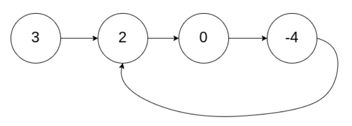
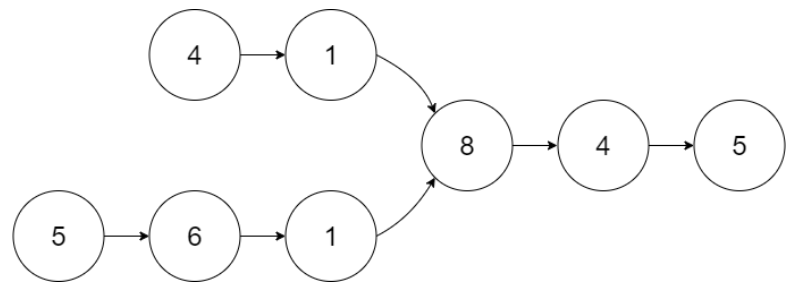
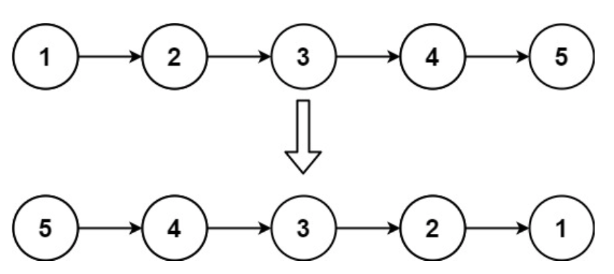
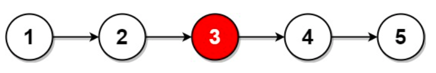
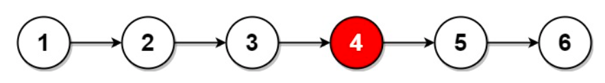
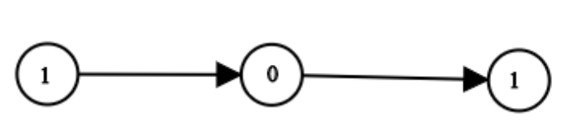
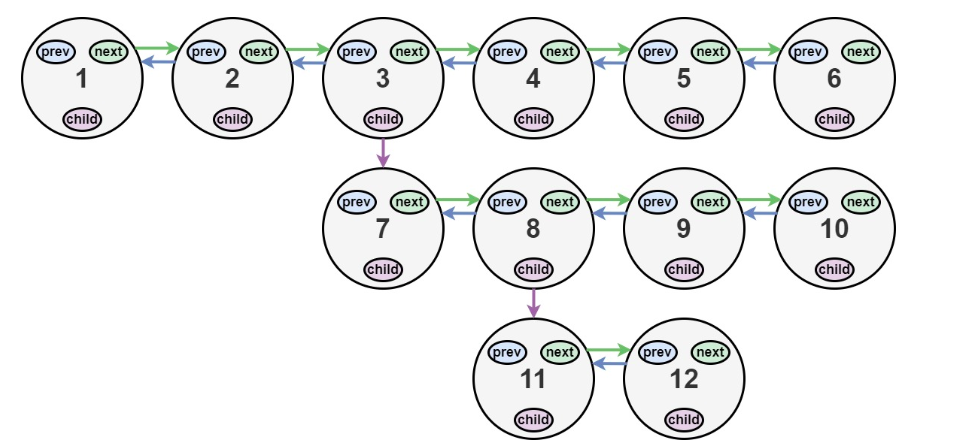
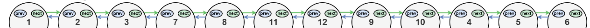

# Двойносвързан списък. Задачи върху списъци.

### Задача 0
Реализирайте двойносвързан списък, който да покрива всички unit тестове във файла `doublyLinkedListTests.cpp`, като имплементирате методите във файла `doublyLinkedList.h` в папката `DoublyLinkedList`.

### Задача 1
Реализирайте функция `removeDuplicatesInSorted`, която премахва всички повторения на елементи в растящо сортиращ едносвързан списък по подадена глава към списъка.

**Ограничения:**
 - времева сложност: O(n)
 - пространствена сложност: O(1)

### Задача 2
Реализирайте функция `hasCycle`, която проверява дали в едносвързан списък има цикъл. В един списък има цикъл, ако една и съща кутия може да бъде достъпена повече от веднъж при последователно обхождане на списъка чрез `next` указателя.

**Пример:**

**Ограничения:**
 - времева сложност: O(n)
 - пространствена сложност: O(n) (бонус: O(1))

 ### Задача 3
 Реализирайте функция `getIntersectionNode`, която при дадени глави на два едносвързани списъка връща кутията, при която двата списъка се пресичат. Ако двата списъка не се пресичат, върнете `nullptr`.

 **Пример:**

**Ограничения:**
 - времева сложност: O(n)
 - пространствена сложност: O(1)

 ### Задача 4
 Реализирайте функция `removeElements`, която по подадена глава на едносвързан списък и число `n` премахма всички срещания на числото `n` в списъка.

 **Ограничения:**
 - времева сложност: O(n)
 - пространствена сложност: O(1)

 ### Задача 5
 Реализирайте функция `reverseList`, която по подедена глава на едносвързан списък обръща списъка.

  **Пример:**

**Ограничения:**
 - времева сложност: O(n)
 - пространствена сложност: O(1)

 ### Задача 6
 Реализирайте функция `isPalindrome`, която по подадена глава на едносвързан списък проверява дали списъкът е палиндром.

 **Ограничения:**
 - времева сложност: O(n)
 - пространствена сложност: O(1)

 ### Задача 7
 Реализирайте функция `middleNode`, която по подадена глава на едносвързан списък връща кутията на средния елемент. Ако има два средни елемента (когато списъкът е с четна дължина), върнете втория.

**Пример:**
 
 

 **Ограничения:**
 - времева сложност: O(n)
 - пространствена сложност: O(1)

 ### Задача 8
 Реализирайте функция `getDecimalValue`, която по подадена глава на едносвързан списък, състоящ се само от `0` и `1`, връща число в десетична бройна система. Списъкът представя числото в двоична бройна система, като първата кутия съдържа най-старшият бит на числото.
 
 **Пример:**
 

 **Ограничения:**
 - времева сложност: O(n)
 - пространствена сложност: O(1)

 ### Задача 9
 Реализирайте функция `flatten`, която по подадена глава към тройносвързан списък го "смачква" до двойносвързан списък. Една кутия от тройносвързан списък има три указателя - `previous`, `next` и `child`. Така е възможно да се образува структура от данни "на много нива". Вашата задачата е да трансформирате тази структура от данни до такава на едно ниво (обикновен двойносвързан списък). 

 **Пример:**
 
 

> Забележка: Транформирайте примера от картинката в подходящ unit тест.

### Задача 10
Решете задачи 1-8 за двусвързан списък, напишете подходящи unit тестове.

### :warning: Забележки

- Погрижете се за правилното използване на динамична памет и не допускайте memory leaks
- Целете се към максимално спазване на чист код
- Не е позволено използването на `std::forward_list` и на `std::list`