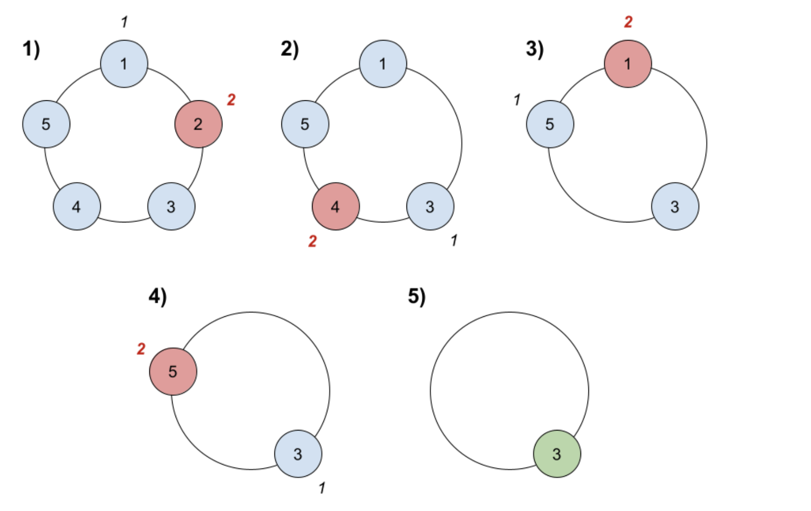

# Опашка.

### Задача 0
Реализирайте две имплементации на опашка:
 - чрез динамичен масив - в `dynamicQueue.h` (тестове в `dynamicQueuetests.cpp`)
    - ако се чувствате уверени в знанията по реализиране на динамичен масив, използвайте директно `std::vector`
 - чрез кутии (свързано представяне) - в `linkedQueue.h` (тестове в `linkedQueueTests.cpp`)

### Задача 1
Реализирайте опашка чрез 2 стека.


### Задача 2
Проверете дали дадена опашка е сортирана.

### Задача 3
Даден е символен низ `s`, намерете първият неповтарящ се символ в низа и върнете индекс към него. Ако такъв няма, върнете `-1`.

```
Примерен вход 1: abracadab
Примерен изход 1: 2

Примерен вход 2: aabb
Примерен изход 2: -1
```

### Задача 4
`n` на брой приятели играят игра. Те са наредени в кръг и са номерирани с числа от `1` до `n` по часовниковата стрелка. Правилата на играта са следните:

 1. Започва се с приятел номер `1`.
 2. Броят се `k` на брой приятеля, включително текущия. При броенето кръгът може да се завърти и някой да бъде преброен повече от веднъж.
 3. Последният преброен напуска кръга и губи играта.
 4. Ако все още има повеве от 1 останал в играта, се повтаря стъпка `2`, започвайки от приятеля, намиращ се точно след този, който последно е напуснал играта.
 5. Иначе последният останал приятел печели играта.



```
Примерен вход: n = 5, k = 2
Примерен изход: 3
```