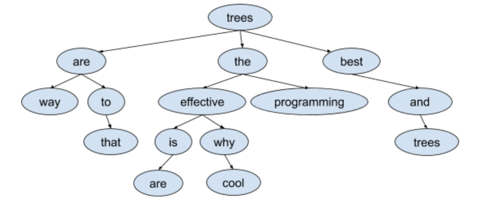
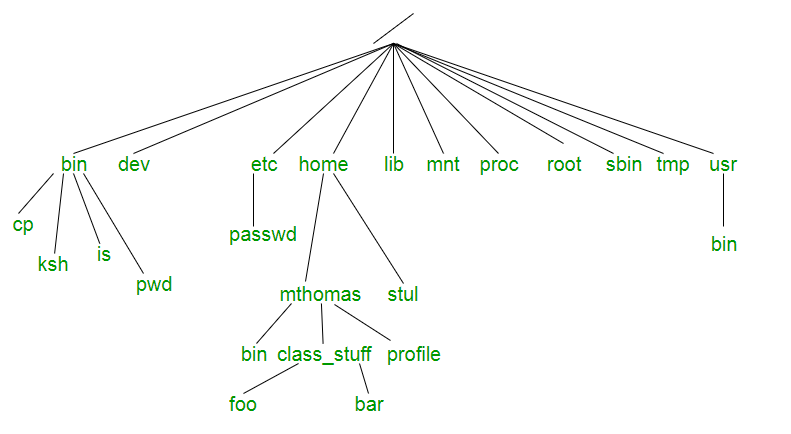
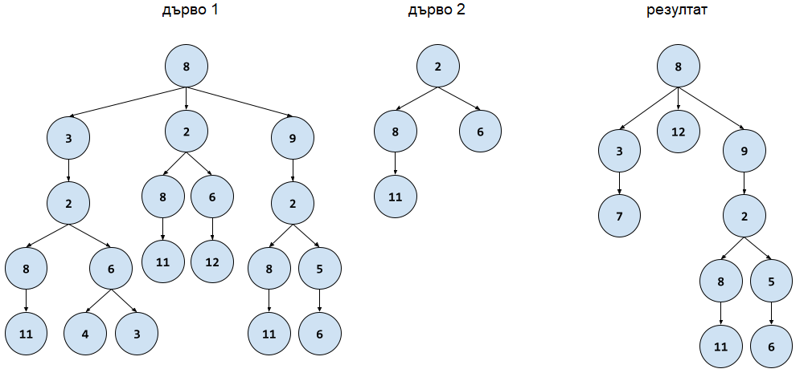

# Дървета

### Задача 1
Да се напише фунцкия, която проверява дали дадено двоично дърво е двоично дърво за търсене.

### Задача 2
Да се напише функция, която намира `k`-тото по големина число в двоично дърво за търсене.

### Задача 3
Да се напише функция, която приема `N`-арно дърво и връща списък от списъци, като всеки списък репрезентира едно ниво на дървото.

### Задача 4
Напишете програма, която работи с дървета с произволна разклоненост и елементи
символни низове от малки или главни латински букви.
1. Да се напише функция, която по подадено има на файл построява такова дърво
по данни от съответния текстов файл.
Форматът на файла е следния:
На всеки ред са думите от едно ниво на дървото, на първия ред е думата от корена, на следващия, думите от неговите наследници и т.н.
Всички думи във файла са разделени с интервали, като между думите за
елементи братя няма други разделители, а между две братства има символ
звезда `*`.
Ако в дадено братство няма думи, когато от ниво преди последното
елемент е листо, то за това братство има празно множество думи (две
последователни звезди).
2. Да се напише функция, която по подаден корен към такова дърво съставя
изречението, получено от най-десните думи за всяко ниво, слепени с интервал.
3. Да се напише програма, която демонстрира използването на горните две
функции.



Входен файл:
```
trees
are the best
way to * effective programming * and
* that * is why * * trees
* are * cool *
```

Изход:
```
trees best and trees cool
```

### Задача 5
Напишете програма, която по дадени име на начална директория и на крайна директория, намира релевантния път на търсената директория.



Вход:
```
home bar
```

Изход:
```
./mthomas/class_stuff/bar
```

### Задача 6
Напишете програма, която работи с дървета съдържащи във възлите си цели числа и имащи произволна разклоненост. Числата са произволни стойности от тип int и могат да се повтарят в дървото. Единственото ограничение е, че един възел не може да има два преки наследника с една и съща стойност.

В тази задача можете да използвате структурите от данни и алгоритмите от стандартната библиотека.

Вашата програма трябва да реализира описаните по-долу функции.

**а)** *(5 т.)* Функция, която прочита дърво от подаден чрез името си текстов файл. Във файла дървото е описано по следния начин:

всеки ред представлява едно ниво от дървото. Елементите на реда са разделени с един или повече интервали;
в едно ниво братствата са разделени с вертикална черта |. Всеки ред започва и завършва с такава черта;
ако на дадено ниво елемент е листо, то на следващото ниво братството на неговите наследници е празно | |;
братства съществуват само за елементи от предното ниво (т.е. ако на ниво N има листо, то на ниво N+1 имаме празно братство за него и на всяко по-долно ниво няма следа от този елемент).
**б)** *(5 т.)* Функция, която по дадени две дървета проверява дали второто се среща някъде в първото. Това означава, че в първото съществува поддърво, чийто корен може да се съпостави на корена на второто и при премахване на елементи от това поддърво ще се получи второто дърво. Позволено е пренареждане на елементите в братство, но не и между нивата на дървото. При съвпадение на два възела трябва да се съблюдава съвпадение на стойностите им.

**в)** *(4 т.)* Функция, която по подадени две дървета премахва всяко срещане (съгласно точка б) на второто от първото. Ако при премахване на срещането останат под-дървета, за които бащата на коренът им е премахнат, то те да се премахнат също, но сумата от елементите им да се съхрани като един елемент, който да се постави на мястото на корена на премахнатото дърво.

**г)** *(3 т.)* Функция, която записва дърво във текстов файл, съгласно формата от точка а)

**д)** *(3 т.)* Напишете програма, която получава имената на три файла от командния ред (чрез `argv/argc`), прочита две дървета от първите два файла, премахва всички срещания на второто дърво от първото, съгласно описаната в точка в) операция и записва резултата в нов файл с име третия аргумент.



Пример:
**Входно дърво 1**
```
| 8 |
| 3 2 9 |
| 2 | 8 6 | 2 |
| 8 6 | 11 | 12 | 8 5 |
| 11 | 4 3 | | | 11 | 6 |
| | | | | | 
```

**Входно дърво 2**
```
| 2 |
| 8 6 |
| 11 | |
| |
```

**Резултат:**
```
| 8 |
| 3 12 9 |
| 7 | | 2 |
| | 8 5 |
| 11 | 6 |
| | |
```